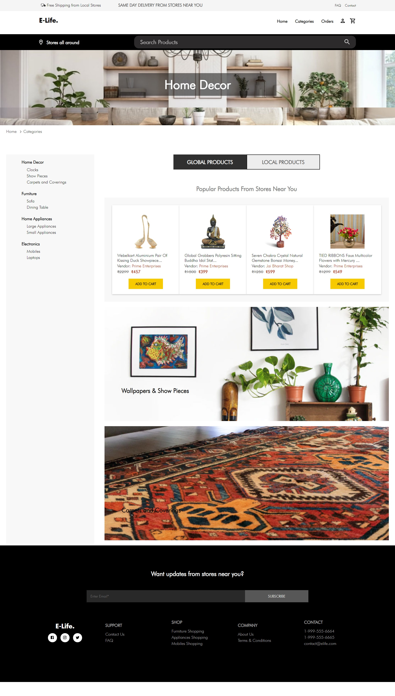

### E-life-Frontend(UI)


## Table of contents
* [Introduction](#intro)
* [Technologies](#technologies)
* [Setup](#setup)
* [Features](#features)
* [Project Status](#project-status)
* [Sources](#sources)
* [Screenshots](#screenshots)
* [Contributors](#contributors)

## Introduction
E-life-frontend is react based user interface that provides a eCommerce platform for the global and local vendors to sell their products online with good benfits to the customers who buying their products. One of the best benifit of this platform user can get product delivery with in the hours or in a day if he purchase product from local vendors which are near by his/her location.

**-Live demo [_here_](https://elife.netlify.app/).**

Frontend and Backend are hosted on Heroku.

## Technologies
  I-Frontend:	 ReactJS, React-Redux, Redux-Saga, - Material UI
  -Backend: 	 NodeJS, Parse
  -Database:   MongoDB
  -Tools:      GIT, Netlify, Razor pay, Back4App


## Setup

Requires [Node.js](https://nodejs.org/) to run (v10+).

Install the dependencies and devDependencies and start the server.

```sh
$ cd hirebook-Frontend
$ npm install
$ npm run start
```

Verify by navigating to below address in your preferred browser.

```sh
localhost:[3000] or running port
```

## Features
  - UI is complelety build on react and functional component.
  - Google Map Integration to set user location 
  - Easy to navigate through the page(SPA)
  - Unit test coverage(React Testing Library)
  - End-to-End testing using Cypress
  - Authentication
  - Responsive(Mobile, Tablet & Desktop)

## Project Status
  - In Progress

## Sources
  TBD

## Screenshots
<table>
  <tr>
    <td align="center">
       **HOME** <br/>
      <a  href="https://elife.netlify.app/" >
            
       </a>
    </td>
    <td align="center">
              **Category** <br />
      <a  href="https://elife.netlify.app/categories" >
            
       </a>
    </td>

    
  </tr>
</table>


## Contributors ✨

<table>
  <tr>
    <td align="center"><a href="#"><br /><sub><b>Omkar Kamble</b></sub></a><br /><a href="" title="Code">💻</a></td>
    <td align="center"><a href="#"><br /><sub><b>Shrikant Patil</b></sub></a><br /><a href="" title="Code">💻</a></td>
    
  </tr>
</table>
